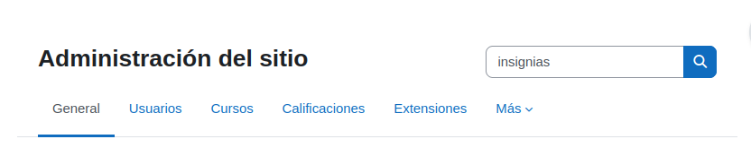
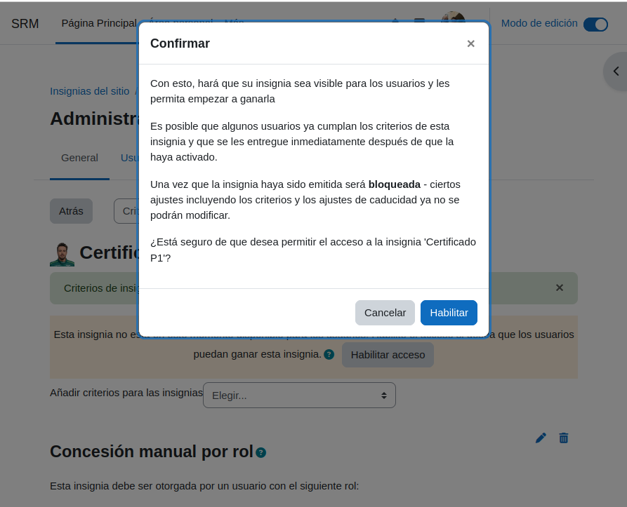
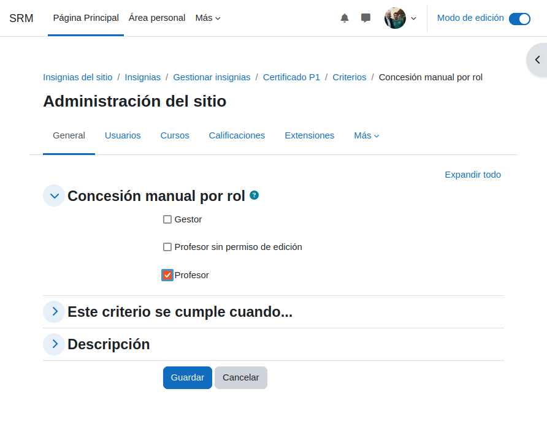

# Moodle-Config
### 1- *Configuración del curso y nuestro usuario*
Modificamos los datos que saldran en nuestro perfil de moodle.

Debemos de ponerle nombre al curso, completando todas las casillas obligatorias.

### 2- *Configuraremos el idioma y la configuración visual de Moodle*

Añadimos el tamaño de la contraseña a 4 caracteres en la configuración del curso para que se necesite ponerla al intentar entrar en el curso.

Vamos a crear 2 cursos, uno con el nombre A y otro con el nombre B selecionando el boton de color azul ***Crear Curso*** .

Dentro del curso **A** cambiaremos el nombre de 3 temas
Dentro del curso **B** cambiaremos el nombre a 5 temas

Y de esta manera podemos tener nuestros propios temas para el curso.
#### + Añadir una actividad o un recurso
Dentro del curso **A** vamos a añadirle 2 PDF en forma de tarea para cada **TEMA** al cual le hemos cambiado el nombre.

### 3- *Añadir usuarios y asignar roles*
Vamos a entrar en el apartado:
#### Administración del sitio --> Usuarios --> General 
Lo llamaremos Bob, añadiendole una contraseña.

Vamos a Descargar datos de tabla como Valores separados por comas **(.csv)**

Una vez lo descargemos vamos a ir a la carpeta en la cual se ha **DESCARGADO** el archivo y lo vamos a modificar metiendonos dentro del bloc de notas que usemos.
Vamos a copiar lo que sale en la imagen de abajo dentro de las notas

#### Entraremos en la administración del sitio --> Cuentas --> Subir usuarios
Vamos a importar el archivo (.csv)

Si lo hemos hecho bien nos saldran todos los usuarios de manera correcta talcual se ve en las imagenes

Vamos a borrar 2 usuarios.

Primero nos vamos a dirigir a el curso A y vamos a configurar que absolutamente nadie se pueda inscribir al curso

Entraremos dentro del curso B para poder modificar el metodo de autentificación para poder registrarnos

Vamos a irnos a los metodos de matriculación

#### Participantes --> Métodos de matriculación
Nos vamos a asegurar de que este activada la matriculación manual **(tenemos el ojo sin tachar)**
#### Nos dirijiremos al curso B y matricularemos a los usuarios añadiendo los cuales hicimos en el bloc de notas. Tambien añadiremos a Bob como profesor.

#### Participantes --> Usuarios matriculados --> *Matricular usuarios*

Hacemos que bob sea profesor de los cursos **A** y **B** y añadimos a los 8 usuarios que tenemos

Vamos a dirigirnos al panel de cursos 

Entramos al curso **A** para hacer una tarea con **PDF**, nos vamos a dirigir a una tema y seleccionaremos:
#### + Añadir una actividad o un recurso
Y lo configuraremos de esta manera siguiendo los pasos

Seleccionamos una tarea para añadirla a nuestro tema.

Entramos como alumno para poder asegurarnos de que la vemos correctamente y que nuestros alumnos pueden hacerla. 

# Tareas y UF
Vamos a crear 2 Unidades Formativas en las cuales añadiremos 2 NF
#### + Añadir una actividad o un recurso
Seleccionaremos **Area de texto y medios**

Le pondremos el nombre de NF1 y NF2

### Seleccionaremos Actividad --> Tareas
Y la crearemos

Una vez este creada nos meteremos como alumno y entregaremos la tarea

### Usuarios --> Student Eight --> Entrar como

Una vez entregada vamos a volver a dirigirnos a nuestro perfil de profesor cerrando sesion y entrando al perfil para pode evaluar la tarea que nuestro alumno ha enviado.

### Boton azul (Calificar)

Ahora si nos dirigimos al apartado de calificaciones podemos ver que ese alumno tendra un **100%** en el curso ya que solo tenemos como nota la actividad.

# Insignias
El primer paso sera dirigirnos a 

#### Administración del sitio --> Insignias (en la barra de busqueda)

Gestion de insignias

Vamos a seleccionar el boton azul de **Añadir una nueva insignia**

Cuando se nos despliegue el menu vamos a poner el **Nombre** la **Descripción** y la **Imagen**

Vamos a poner que el criterio en **Concesión manual por rol**

#### Marcamos la casilla de *Profesor*

Cuando ya terminemos de hacerla se la asignaremos a una persona (en este caso debe de ser a un profesor porque anteriormente marcamos que lo sea)

Vamos a **Habilitar acceso**

#### Habilitar

Cuando nos salga este menu deberemos de **Otorgar insignia** a una persona

En el panel de la derecha seleccionaremos a **bob bob** 

#### Otorgar insignia

Y ya podremos ver que nuestro profesor **bob** tiene la insignia asignada

