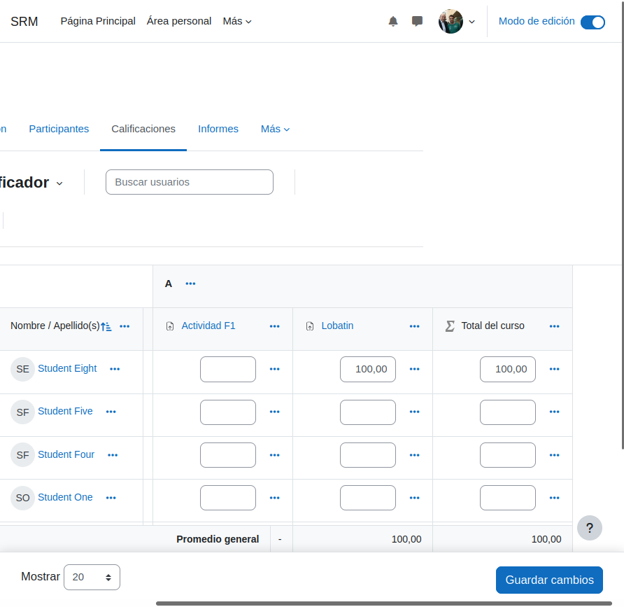
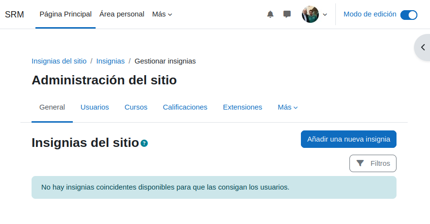
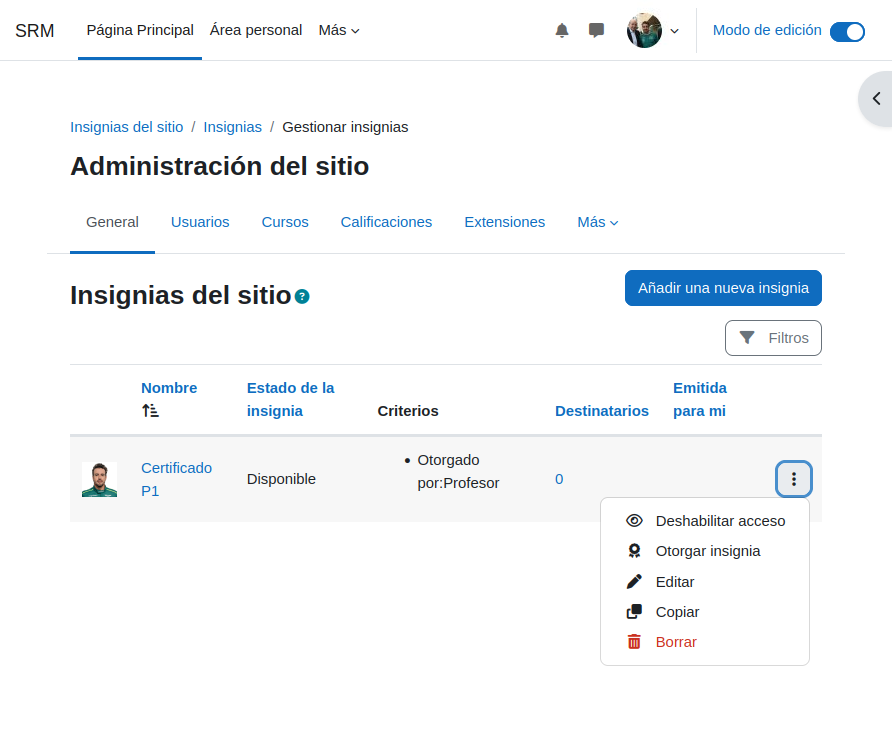

# Moodle-Config
### 1- *Configuración de usuario y curso*
Modificamos los datos que saldran en nuestro perfil de moodle.

Debemos de ponerle nombre al curso, completando todas las casillas obligatorias.

### 2- *Configuraremos el idioma y la configuración visual de Moodle*

Añadimos el tamaño de la contraseña en la configuración del curso para que se necesite ponerla al intentar entrar en el curso.

Vamos a crear 2 cursos, uno con el nombre A y otro con el nombre B selecionando el boton de color azul Crear Curso .

Una vez creados los 2, vamos a añadir en 2 categorias archivos PDF seleccionando 
#### + Añadir una actividad o un recuraso

### 3- *Añadir usuarios y asignar roles*
Vamos a tener que entrar en el apartado:
#### Administración del sitio --> Usuarios --> General 
Lo llamaremos Bob, añadiendole una contraseña.

Vamos a Descargar datos de tabla como Valores separados por comas (.csv)

Una vez lo descargemos vamos a ir a la carpeta en la cual se ha DESCARGADO el archivo y lo vamos a modificar en el bloc de notas que usemos.
Vamos a copiar lo que sale en la imagen de abajo dentro de las notas

#### Entraremos en la administración del sitio --> Cuentas --> Subir usuarios
Vamos a importar el archivo (.csv)

Si lo hemos hecho bien nos saldran todos los usuarios de manera correcta talcual se ve en las imagenes

Vamos a borrar 2 usuarios.

Entraremos dentro del curso B para poder modificar el metodo de autentificación para poder registrarnos

Vamos a irnos a los metodos de matriculación
#### Participantes --> Métodos de matriculación
y nos aseguraremos de que este activada la matriculación manual *(tenemos el ojo sin tachar)*
## Nos dirijiremos al curso B y matricularemos a los usuarios añadiendo a Bob como profesor

#### Participantes --> Usuarios matriculados --> *Matricular usuarios*

Hacemos que bob sea uno de los profesores del curso y añadimos a los 8 usuarios que tenemos

Volvemos a poner el Método de matriculación manual como en el paso anterior
#### Participantes --> Métodos de matriculación

